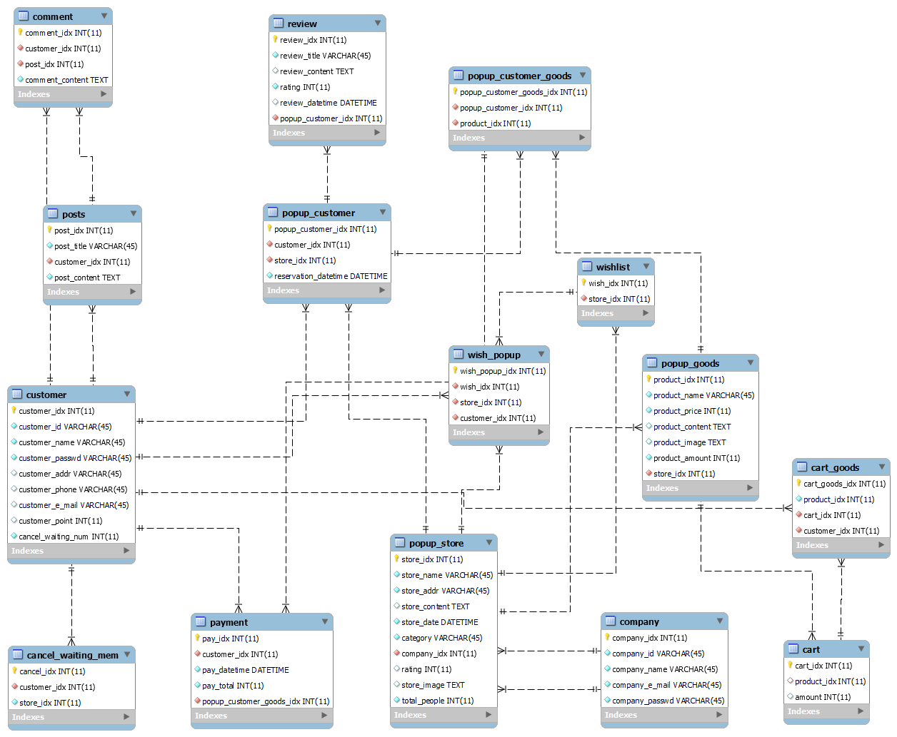

 

> **[플레이 데이터] 한화시스템 BEYOND SW캠프 / 🖐🏻 Team : FIIIIIVE 🖐🏻**

 

## 👩🏻‍💻‍ 팀원
 

<table>
 <tr>
        <td align="center">
            
	
 </td>
        <td align="center">
            
        </td>
        <td align="center">
            
        </td>
        <td align="center">
            
        </td>
        <td align="center">
            
        </td>
    </tr>
    <tr>
 <td align="center">
            <b>박성준</b>
        </td>
        <td align="center">
            <b>강혜정</b>
        </td>
        <td align="center">
            <b>박종성</b>
        </td>
        <td align="center">
            <b>송나경</b>
        </td>
        <td align="center">
            <b>정수연</b>
        </td>
    </tr>
    <tr>
        <td align="center"">
            <b>Team Leader</b>
        </td>
        <td align="center">
            <b>Backend</b>
        </td>
        <td align="center">
            <b>Backend</b>
        </td>
        <td align="center">
            <b>Backend</b>
        </td>
        <td align="center">
            <b>Backend</b>
        </td>
    </tr>
</table>

 

---
 

### 👨🏻‍🏫 프로젝트 기본 소개
 

&nbsp;&nbsp;&nbsp;&nbsp; 최근에는 화장품이나 의류를 넘어 드라마, 음악, 게임, 영화, 애니메이션 등 상관없이 각 업계에서 팝업스토어를 활용하고 있다. 팝업스토어에서는 기존 매장과의 차별점을 두기 위해 한정판 굿즈를 판매하고, 이를 구매하기 위해 장시간 대기하는 현상이 급증하는 추세다.  
&nbsp;&nbsp;&nbsp;&nbsp; **🏠ZIP_POP**은 사전예약을 통해 기존의 팝업스토어 대기 시스템을 개선하고 밤샘 대기 또는 장시간 대기로 인한 고객과 해당 팝업 주변 거주민의 불편을 해소하는 서비스를 제공한다. 매장 입성에 성공했음에도 재고 소진 등의 이유로 원하는 물품을 구하지 못하는 상황을 방지할 수 있도록 사전예약자에 한해 굿즈를 선구매할 수 있는 서비스 또한 제공한다. 예약 기능 없이 정보 제공을 목적으로 하는 유사 사이트와 달리, **🏠ZIP_POP**은 하나의 사이트에서 팝업스토어와 관련된 정보 파악뿐만 아니라 예약 및 굿즈 구매까지 가능하다는 차별점이 있다.

 

---

### 💡 프로젝트 배경
 

<figure class="half">
 
</figure>
 

 

- 대학원생 한지선씨(30)는 인기 유튜버 '침착맨'의 팝업스토어에 방문하기 위해 치열한 예약 경쟁을 뚫었다. 침착맨 팬 커뮤니티에서 예약 팁도 전수받았지만 "인기 상품이 모두 품절돼 아쉬워 아침 일찍 다시 방문해 볼까 생각 중이다"라고 말했다.

 

<figure class="half">

</figure>
 

 

- 더현대서울은 2021년 2월 개점 후 2023년 11월 중순까지 약 460회의 팝업스토어를 운영했다. 이틀에 한 개꼴로 새로운 팝업스토어를 연 셈이다. ‘임시 매장’의 이미지였던 팝업스토어가 ‘한정판 전문 매장’으로 진화했다고 본다. 운영 기간 제한이라는 팝업스토어의 특징이 ‘이때 아니면 못 산다’는 인식을 주게 되었다.

 

  
출처
  

- 기사1 : [https://news.mt.co.kr/mtview.php?no=2024051609573785999]  

- 기사2 : [https://www.donga.com/news/Economy/article/all/20231201/122446644/1]

 

---

### 📌 시스템 아키텍처

 

<figure class="half">

</figure>
 

 

---

### ⚙ ERD

 

<figure class="half">

</figure>
 

 

---

### 💻 기술 스택

 

#### &nbsp;　[ DB ]

&nbsp;&nbsp;&nbsp;</a>

#### &nbsp;　[ Backend ]

#### &nbsp;　[ Frontend ]

#### &nbsp;　[ CI/CD ]

&nbsp;&nbsp;&nbsp;&nbsp;</a></a>
&nbsp;&nbsp;&nbsp;&nbsp;</a></a>

 
